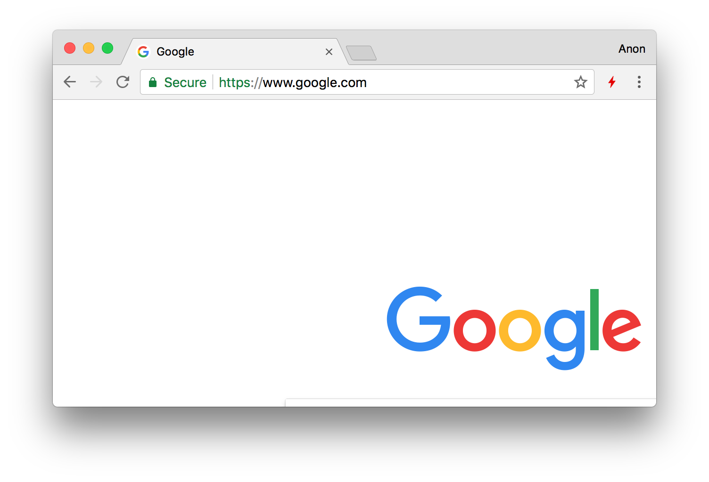

# HTTP Indicator

Indicator for HTTP/2, QUIC and HTTP/3. Install it from [Chrome Web Store](https://chrome.google.com/webstore/detail/hgcomhbcacfkpffiphlmnlhpppcjgmbl) or [Mozilla Add-on](https://addons.mozilla.org/en-US/firefox/addon/http-indicator/).

This extension is an alternative to [HTTP/2 and SPDY indicators](https://chrome.google.com/webstore/detail/http2-and-spdy-indicator/mpbpobfflnpcgagjijhmgnchggcjblin). It uses [Navigation Timing 2](https://www.w3.org/TR/navigation-timing-2/) instead of [deprecated](https://developers.google.com/web/updates/2017/12/chrome-loadtimes-deprecated) `chrome.loadTimes()` API.

## Indicator explanation
 = Default icon  
 = HTTP1 icon  
 = HTTP2 icon  
 = HTTP3 icon  
 = QUIC icon  
 = SPDY icon  

## Credits

- [Ionicons](https://ionicons.com/)

## License

MIT
