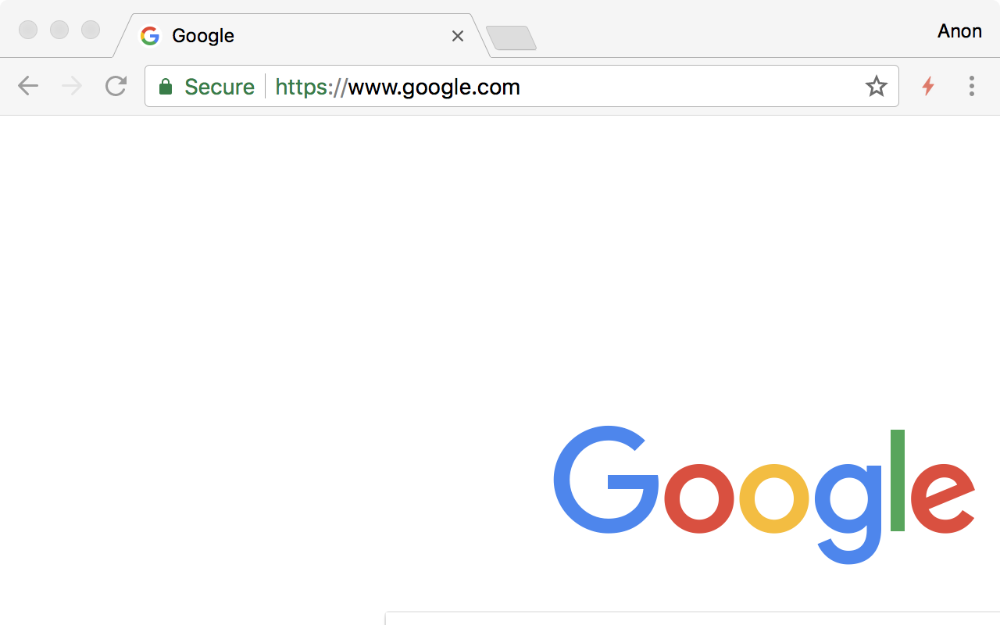

# HTTP Indicator

Indicator for HTTP/2 and QUIC support. [Chrome Web Store](https://chrome.google.com/webstore/detail/http-indicator/hgcomhbcacfkpffiphlmnlhpppcjgmbl)

This extension is an alternative to [HTTP/2 and SPDY indicators](https://chrome.google.com/webstore/detail/http2-and-spdy-indicator/mpbpobfflnpcgagjijhmgnchggcjblin). It use [Navigation Timing 2](https://www.w3.org/TR/navigation-timing-2/) instead of [deprecated](https://developers.google.com/web/updates/2017/12/chrome-loadtimes-deprecated) `chrome.loadTimes()` API.

## Credits

Icons taken from [HTTP/2 and SPDY indicators](https://chrome.google.com/webstore/detail/http2-and-spdy-indicator/mpbpobfflnpcgagjijhmgnchggcjblin).

## License

MIT
